1. 数据总览
Titanic 生存模型预测，其中包含了两组数据：train.csv 和 test.csv，分别为训练集合和测试集合。


```python
import re
import numpy as np
import pandas as pd
import matplotlib.pyplot as plt
import seaborn as sns

import warnings
warnings.filterwarnings('ignore')

%matplotlib inline
```

观察前几行的源数据：


```python
train_data  = pd.read_csv('D:/jupter/data/train.csv', header = 0, dtype={'Age': np.float64})
test_data   = pd.read_csv('D:/jupter/data/test.csv' , header = 0, dtype={'Age': np.float64})
full_data = [train, test]

sns.set_style('whitegrid')
train_data.head()
```


<div>
<style scoped>
    .dataframe tbody tr th:only-of-type {
        vertical-align: middle;
    }

    .dataframe tbody tr th {
        vertical-align: top;
    }

    .dataframe thead th {
        text-align: right;
    }
</style>
<table border="1" class="dataframe">
  <thead>
    <tr style="text-align: right;">
      <th></th>
      <th>PassengerId</th>
      <th>Survived</th>
      <th>Pclass</th>
      <th>Name</th>
      <th>Sex</th>
      <th>Age</th>
      <th>SibSp</th>
      <th>Parch</th>
      <th>Ticket</th>
      <th>Fare</th>
      <th>Cabin</th>
      <th>Embarked</th>
    </tr>
  </thead>
  <tbody>
    <tr>
      <th>0</th>
      <td>1</td>
      <td>0</td>
      <td>3</td>
      <td>Braund, Mr. Owen Harris</td>
      <td>male</td>
      <td>22.0</td>
      <td>1</td>
      <td>0</td>
      <td>A/5 21171</td>
      <td>7.2500</td>
      <td>NaN</td>
      <td>S</td>
    </tr>
    <tr>
      <th>1</th>
      <td>2</td>
      <td>1</td>
      <td>1</td>
      <td>Cumings, Mrs. John Bradley (Florence Briggs Th...</td>
      <td>female</td>
      <td>38.0</td>
      <td>1</td>
      <td>0</td>
      <td>PC 17599</td>
      <td>71.2833</td>
      <td>C85</td>
      <td>C</td>
    </tr>
    <tr>
      <th>2</th>
      <td>3</td>
      <td>1</td>
      <td>3</td>
      <td>Heikkinen, Miss. Laina</td>
      <td>female</td>
      <td>26.0</td>
      <td>0</td>
      <td>0</td>
      <td>STON/O2. 3101282</td>
      <td>7.9250</td>
      <td>NaN</td>
      <td>S</td>
    </tr>
    <tr>
      <th>3</th>
      <td>4</td>
      <td>1</td>
      <td>1</td>
      <td>Futrelle, Mrs. Jacques Heath (Lily May Peel)</td>
      <td>female</td>
      <td>35.0</td>
      <td>1</td>
      <td>0</td>
      <td>113803</td>
      <td>53.1000</td>
      <td>C123</td>
      <td>S</td>
    </tr>
    <tr>
      <th>4</th>
      <td>5</td>
      <td>0</td>
      <td>3</td>
      <td>Allen, Mr. William Henry</td>
      <td>male</td>
      <td>35.0</td>
      <td>0</td>
      <td>0</td>
      <td>373450</td>
      <td>8.0500</td>
      <td>NaN</td>
      <td>S</td>
    </tr>
  </tbody>
</table>
</div>


数据信息总览：


```python
train_data.info()
print("-" * 40)
test_data.info()
```

    <class 'pandas.core.frame.DataFrame'>
    RangeIndex: 891 entries, 0 to 890
    Data columns (total 12 columns):
    PassengerId    891 non-null int64
    Survived       891 non-null int64
    Pclass         891 non-null int64
    Name           891 non-null object
    Sex            891 non-null object
    Age            714 non-null float64
    SibSp          891 non-null int64
    Parch          891 non-null int64
    Ticket         891 non-null object
    Fare           891 non-null float64
    Cabin          204 non-null object
    Embarked       889 non-null object
    dtypes: float64(2), int64(5), object(5)
    memory usage: 83.6+ KB
    ----------------------------------------
    <class 'pandas.core.frame.DataFrame'>
    RangeIndex: 418 entries, 0 to 417
    Data columns (total 11 columns):
    PassengerId    418 non-null int64
    Pclass         418 non-null int64
    Name           418 non-null object
    Sex            418 non-null object
    Age            332 non-null float64
    SibSp          418 non-null int64
    Parch          418 non-null int64
    Ticket         418 non-null object
    Fare           417 non-null float64
    Cabin          91 non-null object
    Embarked       418 non-null object
    dtypes: float64(2), int64(4), object(5)
    memory usage: 36.0+ KB
    

从上面我们可以看出，Age、Cabin、Embarked、Fare几个特征存在缺失值。

绘制存活的比例：


```python
train_data['Survived'].value_counts().plot.pie(autopct = '%1.2f%%')
```


    <matplotlib.axes._subplots.AxesSubplot at 0x28875bc5320>


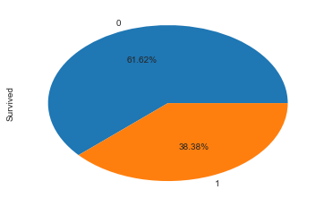


# 2. 缺失值处理的方法
对数据进行分析的时候要注意其中是否有缺失值。

一些机器学习算法能够处理缺失值，比如神经网络，一些则不能。对于缺失值，一般有以下几种处理方法：

（1）如果数据集很多，但有很少的缺失值，可以删掉带缺失值的行；

（2）如果该属性相对学习来说不是很重要，可以对缺失值赋均值或者众数。比如在哪儿上船Embarked这一属性（共有三个上船地点），缺失俩值，可以用众数赋值


```python
train_data.Embarked[train_data.Embarked.isnull()] = train_data.Embarked.dropna().mode().values

```

（3）对于标称属性，可以赋一个代表缺失的值，比如‘U0’。因为缺失本身也可能代表着一些隐含信息。比如船舱号Cabin这一属性，缺失可能代表并没有船舱。


```python
train_data['Cabin'] = train_data.Cabin.fillna('U0') # train_data.Cabin[train_data.Cabin.isnull()]='U0'

```

（4）使用回归 随机森林等模型来预测缺失属性的值。因为Age在该数据集里是一个相当重要的特征（先对Age进行分析即可得知），所以保证一定的缺失值填充准确率是非常重要的，对结果也会产生较大影响。一般情况下，会使用数据完整的条目作为模型的训练集，以此来预测缺失值。对于当前的这个数据，可以使用随机森林来预测也可以使用线性回归预测。这里使用随机森林预测模型，选取数据集中的数值属性作为特征（因为sklearn的模型只能处理数值属性，所以这里先仅选取数值特征，但在实际的应用中需要将非数值特征转换为数值特征）


```python
from sklearn.ensemble import RandomForestRegressor

#choose training data to predict age
age_df = train_data[['Age','Survived','Fare', 'Parch', 'SibSp', 'Pclass']]
age_df_notnull = age_df.loc[(train_data['Age'].notnull())]
age_df_isnull = age_df.loc[(train_data['Age'].isnull())]
X = age_df_notnull.values[:,1:]
Y = age_df_notnull.values[:,0]
# use RandomForestRegression to train data
RFR = RandomForestRegressor(n_estimators=1000, n_jobs=-1)
RFR.fit(X,Y)
predictAges = RFR.predict(age_df_isnull.values[:,1:])
train_data.loc[train_data['Age'].isnull(), ['Age']]= predictAges

```

让我们再来看一下缺失数据处理后的DataFram：


```python
train_data.info()
```

    <class 'pandas.core.frame.DataFrame'>
    RangeIndex: 891 entries, 0 to 890
    Data columns (total 12 columns):
    PassengerId    891 non-null int64
    Survived       891 non-null int64
    Pclass         891 non-null int64
    Name           891 non-null object
    Sex            891 non-null object
    Age            891 non-null float64
    SibSp          891 non-null int64
    Parch          891 non-null int64
    Ticket         891 non-null object
    Fare           891 non-null float64
    Cabin          891 non-null object
    Embarked       891 non-null object
    dtypes: float64(2), int64(5), object(5)
    memory usage: 83.6+ KB
    

# 3. 分析数据关系
# (1) 性别与是否生存的关系 Sex


```python
train_data.groupby(['Sex','Survived'])['Survived'].count()
```


    Sex     Survived
    female  0            81
            1           233
    male    0           468
            1           109
    Name: Survived, dtype: int64


```python
train_data[['Sex','Survived']].groupby(['Sex']).mean().plot.bar()
```


    <matplotlib.axes._subplots.AxesSubplot at 0x28875bfa860>


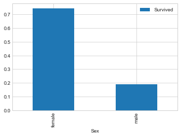


以上为不同性别的生存率，可见在泰坦尼克号事故中，还是体现了Lady First。

# (2) 船舱等级和生存与否的关系 Pclass


```python
train_data.groupby(['Pclass','Survived'])['Pclass'].count()
train_data[['Pclass','Survived']].groupby(['Pclass']).mean().plot.bar()
```


    <matplotlib.axes._subplots.AxesSubplot at 0x288781ca748>


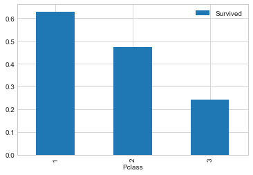


```python
train_data[['Sex','Pclass','Survived']].groupby(['Pclass','Sex']).mean().plot.bar()
```


    <matplotlib.axes._subplots.AxesSubplot at 0x2887822c630>


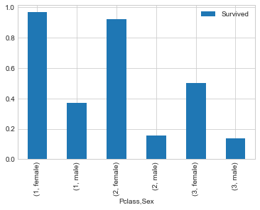


不同等级船舱的男女生存率：


```python
train_data.groupby(['Sex', 'Pclass', 'Survived'])['Survived'].count()
```


    Sex     Pclass  Survived
    female  1       0             3
                    1            91
            2       0             6
                    1            70
            3       0            72
                    1            72
    male    1       0            77
                    1            45
            2       0            91
                    1            17
            3       0           300
                    1            47
    Name: Survived, dtype: int64


# (3) 年龄与存活与否的关系 Age
分别分析不同等级船舱和不同性别下的年龄分布和生存的关系：


```python
fig, ax = plt.subplots(1, 2, figsize = (18, 8))
sns.violinplot("Pclass", "Age", hue="Survived", data=train_data, split=True, ax=ax[0])
ax[0].set_title('Pclass and Age vs Survived')
ax[0].set_yticks(range(0, 110, 10))

sns.violinplot("Sex", "Age", hue="Survived", data=train_data, split=True, ax=ax[1])
ax[1].set_title('Sex and Age vs Survived')
ax[1].set_yticks(range(0, 110, 10))

plt.show()

```


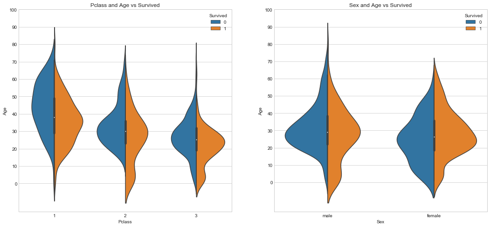


分析总体的年龄分布：


```python
plt.figure(figsize=(12,5))
plt.subplot(121)
train_data['Age'].hist(bins=70)
plt.xlabel('Age')
plt.ylabel('Num')

plt.subplot(122)
train_data.boxplot(column='Age', showfliers=False)

```


    <matplotlib.axes._subplots.AxesSubplot at 0x2887839b6a0>


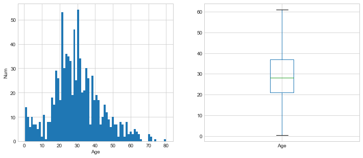


不同年龄下的生存和非生存的分布情况：


```python
facet = sns.FacetGrid(train_data, hue="Survived",aspect=4)
facet.map(sns.kdeplot,'Age',shade= True)
facet.set(xlim=(0, train_data['Age'].max()))
facet.add_legend()

```


    <seaborn.axisgrid.FacetGrid at 0x288783f5208>


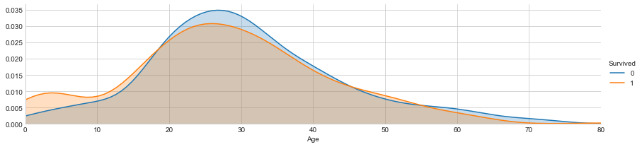


不同年龄下的平均生存率：


```python
# average survived passengers by age
fig, axis1 = plt.subplots(1,1,figsize=(18,4))
train_data["Age_int"] = train_data["Age"].astype(int)
average_age = train_data[["Age_int", "Survived"]].groupby(['Age_int'],as_index=False).mean()
sns.barplot(x='Age_int', y='Survived', data=average_age)

```


    <matplotlib.axes._subplots.AxesSubplot at 0x288784aff60>


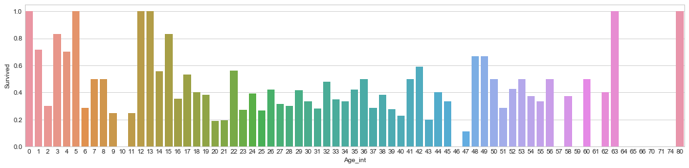


```python
train_data['Age'].describe()
```


    count    891.000000
    mean      29.665749
    std       13.741517
    min        0.420000
    25%       21.000000
    50%       28.000000
    75%       37.000000
    max       80.000000
    Name: Age, dtype: float64


样本有891，平均年龄约为30岁，标准差13.5岁，最小年龄为0.42，最大年龄80.

按照年龄，将乘客划分为儿童、少年、成年和老年，分析四个群体的生还情况：


```python
bins = [0, 12, 18, 65, 100]
train_data['Age_group'] = pd.cut(train_data['Age'], bins)
by_age = train_data.groupby('Age_group')['Survived'].mean()
by_age

```


    Age_group
    (0, 12]      0.506173
    (12, 18]     0.466667
    (18, 65]     0.364512
    (65, 100]    0.125000
    Name: Survived, dtype: float64


```python
by_age.plot(kind = 'bar')
```


    <matplotlib.axes._subplots.AxesSubplot at 0x28879a02588>


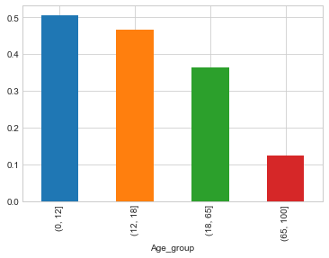


# (4) 称呼与存活与否的关系 Name

通过观察名字数据，我们可以看出其中包括对乘客的称呼，如：Mr、Miss、Mrs等，称呼信息包含了乘客的年龄、性别，同时也包含了如社会地位等的称呼，如：Dr,、Lady、Major、Master等的称呼。


```python
train_data['Title'] = train_data['Name'].str.extract(' ([A-Za-z]+)\.', expand=False)

pd.crosstab(train_data['Title'], train_data['Sex'])
```


<div>
<style scoped>
    .dataframe tbody tr th:only-of-type {
        vertical-align: middle;
    }

    .dataframe tbody tr th {
        vertical-align: top;
    }

    .dataframe thead th {
        text-align: right;
    }
</style>
<table border="1" class="dataframe">
  <thead>
    <tr style="text-align: right;">
      <th>Sex</th>
      <th>female</th>
      <th>male</th>
    </tr>
    <tr>
      <th>Title</th>
      <th></th>
      <th></th>
    </tr>
  </thead>
  <tbody>
    <tr>
      <th>Capt</th>
      <td>0</td>
      <td>1</td>
    </tr>
    <tr>
      <th>Col</th>
      <td>0</td>
      <td>2</td>
    </tr>
    <tr>
      <th>Countess</th>
      <td>1</td>
      <td>0</td>
    </tr>
    <tr>
      <th>Don</th>
      <td>0</td>
      <td>1</td>
    </tr>
    <tr>
      <th>Dr</th>
      <td>1</td>
      <td>6</td>
    </tr>
    <tr>
      <th>Jonkheer</th>
      <td>0</td>
      <td>1</td>
    </tr>
    <tr>
      <th>Lady</th>
      <td>1</td>
      <td>0</td>
    </tr>
    <tr>
      <th>Major</th>
      <td>0</td>
      <td>2</td>
    </tr>
    <tr>
      <th>Master</th>
      <td>0</td>
      <td>40</td>
    </tr>
    <tr>
      <th>Miss</th>
      <td>182</td>
      <td>0</td>
    </tr>
    <tr>
      <th>Mlle</th>
      <td>2</td>
      <td>0</td>
    </tr>
    <tr>
      <th>Mme</th>
      <td>1</td>
      <td>0</td>
    </tr>
    <tr>
      <th>Mr</th>
      <td>0</td>
      <td>517</td>
    </tr>
    <tr>
      <th>Mrs</th>
      <td>125</td>
      <td>0</td>
    </tr>
    <tr>
      <th>Ms</th>
      <td>1</td>
      <td>0</td>
    </tr>
    <tr>
      <th>Rev</th>
      <td>0</td>
      <td>6</td>
    </tr>
    <tr>
      <th>Sir</th>
      <td>0</td>
      <td>1</td>
    </tr>
  </tbody>
</table>
</div>


观察不同称呼与生存率的关系：


```python
train_data[['Title','Survived']].groupby(['Title']).mean().plot.bar()
```


    <matplotlib.axes._subplots.AxesSubplot at 0x28879a86400>


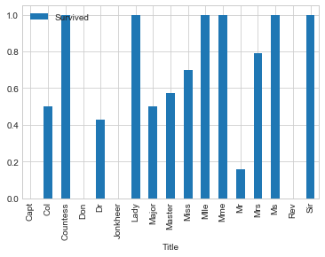


同时，对于名字，我们还可以观察名字长度和生存率之间存在关系的可能：


```python
fig, axis1 = plt.subplots(1,1,figsize=(18,4))
train_data['Name_length'] = train_data['Name'].apply(len)
name_length = train_data[['Name_length','Survived']].groupby(['Name_length'],as_index=False).mean()
sns.barplot(x='Name_length', y='Survived', data=name_length)

```


    <matplotlib.axes._subplots.AxesSubplot at 0x28879ad0f28>


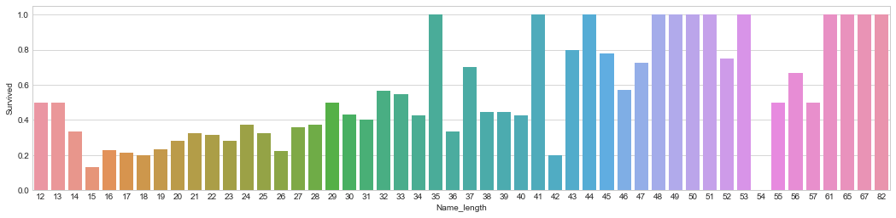


从上面的图片可以看出，名字长度和生存与否确实也存在一定的相关性。

# (5) 有无兄弟姐妹和存活与否的关系 SibSp


```python
# 将数据分为有兄弟姐妹的和没有兄弟姐妹的两组：
sibsp_df = train_data[train_data['SibSp'] != 0]
no_sibsp_df = train_data[train_data['SibSp'] == 0]
plt.figure(figsize=(10,5))
plt.subplot(121)
sibsp_df['Survived'].value_counts().plot.pie(labels=['No Survived', 'Survived'], autopct = '%1.1f%%')
plt.xlabel('sibsp')

plt.subplot(122)
no_sibsp_df['Survived'].value_counts().plot.pie(labels=['No Survived', 'Survived'], autopct = '%1.1f%%')
plt.xlabel('no_sibsp')

plt.show()

```


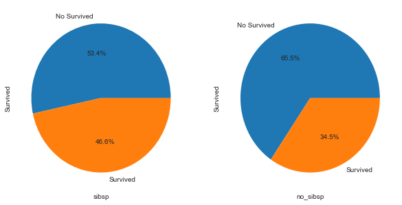


# (6) 有无父母子女和存活与否的关系 Parch

和有无兄弟姐妹一样，同样分析可以得到：


```python
parch_df = train_data[train_data['Parch'] != 0]
no_parch_df = train_data[train_data['Parch'] == 0]

plt.figure(figsize=(10,5))
plt.subplot(121)
parch_df['Survived'].value_counts().plot.pie(labels=['No Survived', 'Survived'], autopct = '%1.1f%%')
plt.xlabel('parch')

plt.subplot(122)
no_parch_df['Survived'].value_counts().plot.pie(labels=['No Survived', 'Survived'], autopct = '%1.1f%%')
plt.xlabel('no_parch')

plt.show()

```


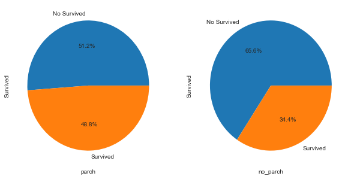


(7) 亲友的人数和存活与否的关系 SibSp & Parch


```python
fig,ax=plt.subplots(1,2,figsize=(18,8))
train_data[['Parch','Survived']].groupby(['Parch']).mean().plot.bar(ax=ax[0])
ax[0].set_title('Parch and Survived')
train_data[['SibSp','Survived']].groupby(['SibSp']).mean().plot.bar(ax=ax[1])
ax[1].set_title('SibSp and Survived')

```


    Text(0.5,1,'SibSp and Survived')


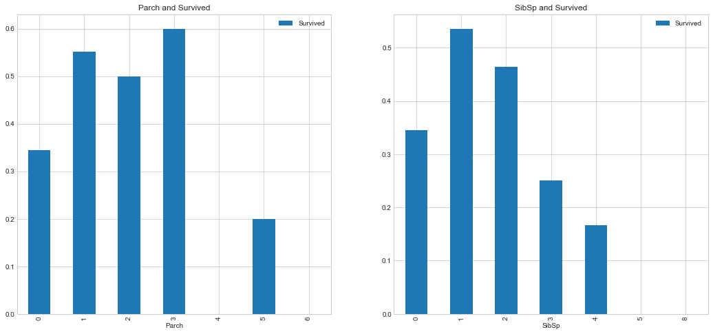


```python
train_data['Family_Size'] = train_data['Parch'] + train_data['SibSp'] + 1
train_data[['Family_Size','Survived']].groupby(['Family_Size']).mean().plot.bar()

```


    <matplotlib.axes._subplots.AxesSubplot at 0x2887a1194a8>


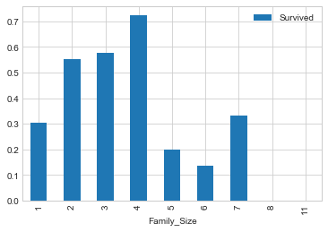


从图表中可以看出，若独自一人，那么其存活率比较低；但是如果亲友太多的话，存活率也会很低。


# (8) 票价分布和存活与否的关系 Fare

首先绘制票价的分布情况：


```python
plt.figure(figsize=(10,5))
train_data['Fare'].hist(bins = 70)

train_data.boxplot(column='Fare', by='Pclass', showfliers=False)
plt.show()
```


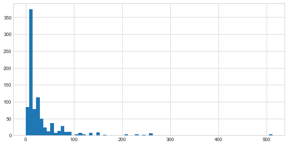


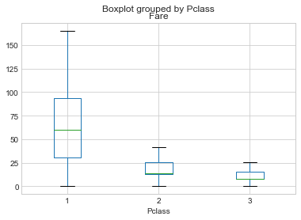


```python
train_data['Fare'].describe()
```


    count    891.000000
    mean      32.204208
    std       49.693429
    min        0.000000
    25%        7.910400
    50%       14.454200
    75%       31.000000
    max      512.329200
    Name: Fare, dtype: float64


绘制生存与否与票价均值和方差的关系：


```python
fare_not_survived = train_data['Fare'][train_data['Survived'] == 0]
fare_survived = train_data['Fare'][train_data['Survived'] == 1]

average_fare = pd.DataFrame([fare_not_survived.mean(), fare_survived.mean()])
std_fare = pd.DataFrame([fare_not_survived.std(), fare_survived.std()])
average_fare.plot(yerr=std_fare, kind='bar', legend=False)

plt.show()

```


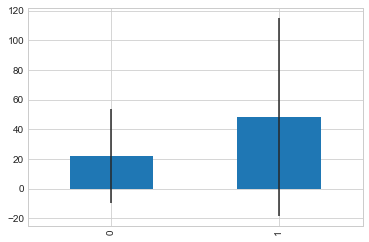


由上图标可知，票价与是否生还有一定的相关性，生还者的平均票价要大于未生还者的平均票价。

# (9) 船舱类型和存活与否的关系 Cabin


由于船舱的缺失值确实太多，有效值仅仅有204个，很难分析出不同的船舱和存活的关系，所以在做特征工程的时候，可以直接将该组特征丢弃。

当然，这里我们也可以对其进行一下分析，对于缺失的数据都分为一类。

简单地将数据分为是否有Cabin记录作为特征，与生存与否进行分析：


```python
# Replace missing values with "U0"
train_data.loc[train_data.Cabin.isnull(), 'Cabin'] = 'U0'
train_data['Has_Cabin'] = train_data['Cabin'].apply(lambda x: 0 if x == 'U0' else 1)
train_data[['Has_Cabin','Survived']].groupby(['Has_Cabin']).mean().plot.bar()

```


    <matplotlib.axes._subplots.AxesSubplot at 0x288782851d0>


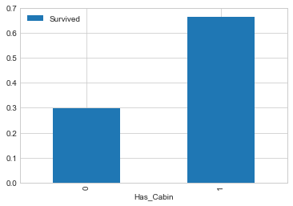


对不同类型的船舱进行分析：


```python
# create feature for the alphabetical part of the cabin number
train_data['CabinLetter'] = train_data['Cabin'].map(lambda x: re.compile("([a-zA-Z]+)").search(x).group())
# convert the distinct cabin letters with incremental integer values
train_data['CabinLetter'] = pd.factorize(train_data['CabinLetter'])[0]
train_data[['CabinLetter','Survived']].groupby(['CabinLetter']).mean().plot.bar()

```


    <matplotlib.axes._subplots.AxesSubplot at 0x28879fcb0f0>


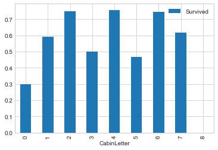


可见，不同的船舱生存率也有不同，但是差别不大。所以在处理中，我们可以直接将特征删除。

# (10) 港口和存活与否的关系 Embarked

泰坦尼克号从英国的南安普顿港出发，途径法国瑟堡和爱尔兰昆士敦，那么在昆士敦之前上船的人，有可能在瑟堡或昆士敦下船，这些人将不会遇到海难。


```python
sns.countplot('Embarked', hue='Survived', data=train_data)
plt.title('Embarked and Survived')
```


    Text(0.5,1,'Embarked and Survived')


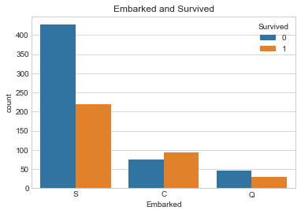


```python
sns.factorplot('Embarked', 'Survived', data=train_data, size=3, aspect=2)
plt.title('Embarked and Survived rate')
plt.show()
```


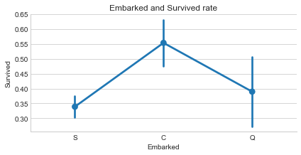


由上可以看出，在不同的港口上船，生还率不同，C最高，Q次之，S最低。

以上为所给出的数据特征与生还与否的分析。

据了解，泰坦尼克号上共有2224名乘客。本训练数据只给出了891名乘客的信息，如果该数据集是从总共的2224人中随机选出的，根据中心极限定理，该样本的数据也足够大，那么我们的分析结果就具有代表性；但如果不是随机选取，那么我们的分析结果就可能不太靠谱了。


# (11) 其他可能和存活与否有关系的特征

对于数据集中没有给出的特征信息，我们还可以联想其他可能会对模型产生影响的特征因素。如：乘客的国籍、乘客的身高、乘客的体重、乘客是否会游泳、乘客职业等等。

另外还有数据集中没有分析的几个特征：Ticket（船票号）、Cabin（船舱号）,这些因素的不同可能会影响乘客在船中的位置从而影响逃生的顺序。但是船舱号数据缺失，船票号类别大，难以分析规律，所以在后期模型融合的时候，将这些因素交由模型来决定其重要性。


# 4. 变量转换

变量转换的目的是将数据转换为适用于模型使用的数据，不同模型接受不同类型的数据，Scikit-learn要求数据都是数字型numeric，所以我们要将一些非数字型的原始数据转换为数字型numeric。

所以下面对数据的转换进行介绍，以在进行特征工程的时候使用。

所有的数据可以分为两类：

1.定性(Quantitative)变量可以以某种方式排序，Age就是一个很好的列子。
2.定量(Qualitative)变量描述了物体的某一（不能被数学表示的）方面，Embarked就是一个例子。


定性(Qualitative)转换：
1. Dummy Variables

就是类别变量或者二元变量，当qualitative variable是一些频繁出现的几个独立变量时，Dummy Variables比较适合使用。我们以Embarked为例，Embarked只包含三个值’S’,’C’,’Q’，我们可以使用下面的代码将其转换为dummies:


```python
embark_dummies = train_data[['S', 'C', 'Q']]
embark_dummies.head()

```


<div>
<style scoped>
    .dataframe tbody tr th:only-of-type {
        vertical-align: middle;
    }

    .dataframe tbody tr th {
        vertical-align: top;
    }

    .dataframe thead th {
        text-align: right;
    }
</style>
<table border="1" class="dataframe">
  <thead>
    <tr style="text-align: right;">
      <th></th>
      <th>S</th>
      <th>C</th>
      <th>Q</th>
    </tr>
  </thead>
  <tbody>
    <tr>
      <th>0</th>
      <td>1</td>
      <td>0</td>
      <td>0</td>
    </tr>
    <tr>
      <th>1</th>
      <td>0</td>
      <td>1</td>
      <td>0</td>
    </tr>
    <tr>
      <th>2</th>
      <td>1</td>
      <td>0</td>
      <td>0</td>
    </tr>
    <tr>
      <th>3</th>
      <td>1</td>
      <td>0</td>
      <td>0</td>
    </tr>
    <tr>
      <th>4</th>
      <td>1</td>
      <td>0</td>
      <td>0</td>
    </tr>
  </tbody>
</table>
</div>


# 2. Factorizing

dummy不好处理Cabin（船舱号）这种标称属性，因为他出现的变量比较多。所以Pandas有一个方法叫做factorize()，它可以创建一些数字，来表示类别变量，对每一个类别映射一个ID，这种映射最后只生成一个特征，不像dummy那样生成多个特征。


```python
# Replace missing values with "U0"
train_data['Cabin'][train_data.Cabin.isnull()] = 'U0'
# create feature for the alphabetical part of the cabin number
train_data['CabinLetter'] = train_data['Cabin'].map( lambda x : re.compile("([a-zA-Z]+)").search(x).group())
# convert the distinct cabin letters with incremental integer values
train_data['CabinLetter'] = pd.factorize(train_data['CabinLetter'])[0]
train_data['CabinLetter'].head()
```


    0    0
    1    1
    2    0
    3    1
    4    0
    Name: CabinLetter, dtype: int64


# 定量(Quantitative)转换：
1. Scaling

Scaling可以将一个很大范围的数值映射到一个很小的范围(通常是-1 - 1，或则是0 - 1)，很多情况下我们需要将数值做Scaling使其范围大小一样，否则大范围数值特征将会由更高的权重。比如：Age的范围可能只是0-100，而income的范围可能是0-10000000，在某些对数组大小敏感的模型中会影响其结果。

下面对Age进行Scaling：


```python
from sklearn import preprocessing

assert np.size(train_data['Age']) == 891
# StandardScaler will subtract the mean from each value then scale to the unit variance
scaler = preprocessing.StandardScaler()
train_data['Age_scaled'] = scaler.fit_transform(train_data['Age'].values.reshape(-1, 1))
train_data['Age_scaled'].head()
```


    0   -0.558167
    1    0.606842
    2   -0.266914
    3    0.388403
    4    0.388403
    Name: Age_scaled, dtype: float64


# 2. Binning

Binning通过观察“邻居”(即周围的值)将连续数据离散化。存储的值被分布到一些“桶”或“箱“”中，就像直方图的bin将数据划分成几块一样。下面的代码对Fare进行Binning。


```python
# Divide all fares into quartiles
train_data['Fare_bin'] = pd.qcut(train_data['Fare'], 5)
train_data['Fare_bin'].head()
```


    0      (-0.001, 7.854]
    1    (39.688, 512.329]
    2        (7.854, 10.5]
    3    (39.688, 512.329]
    4        (7.854, 10.5]
    Name: Fare_bin, dtype: category
    Categories (5, interval[float64]): [(-0.001, 7.854] < (7.854, 10.5] < (10.5, 21.679] < (21.679, 39.688] < (39.688, 512.329]]


在将数据Bining化后，要么将数据factorize化，要么dummies化。


```python
# qcut() creates a new variable that identifies the quartile range, but we can't use the string
# so either factorize or create dummies from the result

# factorize
train_data['Fare_bin_id'] = pd.factorize(train_data['Fare_bin'])[0]

# dummies
fare_bin_dummies_df = pd.get_dummies(train_data['Fare_bin']).rename(columns=lambda x: 'Fare_' + str(x))
train_data = pd.concat([train_data, fare_bin_dummies_df], axis=1)

```

# 5. 特征工程

在进行特征工程的时候，我们不仅需要对训练数据进行处理，还需要同时将测试数据同训练数据一起处理，使得二者具有相同的数据类型和数据分布。


```python
train_df_org = pd.read_csv('D:/jupter/data/train.csv')
test_df_org = pd.read_csv('D:/jupter/data/test.csv')
test_df_org['Survived'] = 0
combined_train_test = train_df_org.append(test_df_org)
PassengerId = test_df_org['PassengerId']

```

对数据进行特征工程，也就是从各项参数中提取出对输出结果有或大或小的影响的特征，将这些特征作为训练模型的依据。 一般来说，我们会先从含有缺失值的特征开始。


# (1) Embarked

因为“Embarked”项的缺失值不多，所以这里我们以众数来填充：


```python
combined_train_test['Embarked'].fillna(combined_train_test['Embarked'].mode().iloc[0], inplace=True)

```

对于三种不同的港口，由上面介绍的数值转换，我们知道可以有两种特征处理方式：dummy和facrorizing。因为只有三个港口，所以我们可以直接用dummy来处理：


```python
# 为了后面的特征分析，这里我们将 Embarked 特征进行facrorizing
combined_train_test['Embarked'] = pd.factorize(combined_train_test['Embarked'])[0]

# 使用 pd.get_dummies 获取one-hot 编码
emb_dummies_df = pd.get_dummies(combined_train_test['Embarked'], prefix=combined_train_test[['Embarked']].columns[0])
combined_train_test = pd.concat([combined_train_test, emb_dummies_df], axis=1)

```

# (2) Sex

对Sex也进行one-hot编码，也就是dummy处理：


```python
# 为了后面的特征分析，这里我们也将 Sex 特征进行facrorizing
combined_train_test['Sex'] = pd.factorize(combined_train_test['Sex'])[0]

sex_dummies_df = pd.get_dummies(combined_train_test['Sex'], prefix=combined_train_test[['Sex']].columns[0])
combined_train_test = pd.concat([combined_train_test, sex_dummies_df], axis=1)

```

# (3) Name

首先先从名字中提取各种称呼：


```python
combined_train_test['Title'] = combined_train_test['Name'].map(lambda x: re.compile(", (.*?)\.").findall(x)[0])

```

将各式称呼进行统一化处理：


```python
title_Dict = {}
title_Dict.update(dict.fromkeys(['Capt', 'Col', 'Major', 'Dr', 'Rev'], 'Officer'))
title_Dict.update(dict.fromkeys(['Don', 'Sir', 'the Countess', 'Dona', 'Lady'], 'Royalty'))
title_Dict.update(dict.fromkeys(['Mme', 'Ms', 'Mrs'], 'Mrs'))
title_Dict.update(dict.fromkeys(['Mlle', 'Miss'], 'Miss'))
title_Dict.update(dict.fromkeys(['Mr'], 'Mr'))
title_Dict.update(dict.fromkeys(['Master','Jonkheer'], 'Master'))

combined_train_test['Title'] = combined_train_test['Title'].map(title_Dict)

```

使用dummy对不同的称呼进行分列：


```python
# 为了后面的特征分析，这里我们也将 Title 特征进行facrorizing
combined_train_test['Title'] = pd.factorize(combined_train_test['Title'])[0]

title_dummies_df = pd.get_dummies(combined_train_test['Title'], prefix=combined_train_test[['Title']].columns[0])
combined_train_test = pd.concat([combined_train_test, title_dummies_df], axis=1)

```

增加名字长度的特征：


```python
combined_train_test['Name_length'] = combined_train_test['Name'].apply(len)
```

# (4) Fare

由前面分析可以知道，Fare项在测试数据中缺少一个值，所以需要对该值进行填充。 
我们按照一二三等舱各自的均价来填充： 
下面transform将函数np.mean应用到各个group中。


```python
combined_train_test['Fare'] = combined_train_test[['Fare']].fillna(combined_train_test.groupby('Pclass').transform(np.mean))

```

通过对Ticket数据的分析，我们可以看到部分票号数据有重复，同时结合亲属人数及名字的数据，和票价船舱等级对比，我们可以知道购买的票中有家庭票和团体票，所以我们需要将团体票的票价分配到每个人的头上。


```python
combined_train_test['Group_Ticket'] = combined_train_test['Fare'].groupby(by=combined_train_test['Ticket']).transform('count')
combined_train_test['Fare'] = combined_train_test['Fare'] / combined_train_test['Group_Ticket']
combined_train_test.drop(['Group_Ticket'], axis=1, inplace=True)

```

使用binning给票价分等级：


```python
combined_train_test['Fare_bin'] = pd.qcut(combined_train_test['Fare'], 5)

```

对于5个等级的票价我们也可以继续使用dummy为票价等级分列：


```python
combined_train_test['Fare_bin_id'] = pd.factorize(combined_train_test['Fare_bin'])[0]

fare_bin_dummies_df = pd.get_dummies(combined_train_test['Fare_bin_id']).rename(columns=lambda x: 'Fare_' + str(x))
combined_train_test = pd.concat([combined_train_test, fare_bin_dummies_df], axis=1)
combined_train_test.drop(['Fare_bin'], axis=1, inplace=True)

```

# (5) Pclass

Pclass这一项，其实已经可以不用继续处理了，我们只需要将其转换为dummy形式即可。

但是为了更好的分析问题，我们这里假设对于不同等级的船舱，各船舱内部的票价也说明了各等级舱的位置，那么也就很有可能与逃生的顺序有关系。所以这里分出每等舱里的高价和低价位。


```python
from sklearn.preprocessing import LabelEncoder

# 建立PClass Fare Category
def pclass_fare_category(df, pclass1_mean_fare, pclass2_mean_fare, pclass3_mean_fare):
    if df['Pclass'] == 1:
        if df['Fare'] <= pclass1_mean_fare:
            return 'Pclass1_Low'
        else:
            return 'Pclass1_High'
    elif df['Pclass'] == 2:
        if df['Fare'] <= pclass2_mean_fare:
            return 'Pclass2_Low'
        else:
            return 'Pclass2_High'
    elif df['Pclass'] == 3:
        if df['Fare'] <= pclass3_mean_fare:
            return 'Pclass3_Low'
        else:
            return 'Pclass3_High'

Pclass1_mean_fare = combined_train_test['Fare'].groupby(by=combined_train_test['Pclass']).mean().get([1]).values[0]
Pclass2_mean_fare = combined_train_test['Fare'].groupby(by=combined_train_test['Pclass']).mean().get([2]).values[0]
Pclass3_mean_fare = combined_train_test['Fare'].groupby(by=combined_train_test['Pclass']).mean().get([3]).values[0]

# 建立Pclass_Fare Category
combined_train_test['Pclass_Fare_Category'] = combined_train_test.apply(pclass_fare_category, args=(
    Pclass1_mean_fare, Pclass2_mean_fare, Pclass3_mean_fare), axis=1)
pclass_level = LabelEncoder()

# 给每一项添加标签
pclass_level.fit(np.array(
    ['Pclass1_Low', 'Pclass1_High', 'Pclass2_Low', 'Pclass2_High', 'Pclass3_Low', 'Pclass3_High']))

# 转换成数值
combined_train_test['Pclass_Fare_Category'] = pclass_level.transform(combined_train_test['Pclass_Fare_Category'])

# dummy 转换
pclass_dummies_df = pd.get_dummies(combined_train_test['Pclass_Fare_Category']).rename(columns=lambda x: 'Pclass_' + str(x))
combined_train_test = pd.concat([combined_train_test, pclass_dummies_df], axis=1)

```

同时，我们将 Pclass 特征factorize化：


```python
combined_train_test['Pclass'] = pd.factorize(combined_train_test['Pclass'])[0]
```

# (6) Parch and SibSp

由前面的分析，我们可以知道，亲友的数量没有或者太多会影响到Survived。所以将二者合并为FamliySize这一组合项，同时也保留这两项。


```python
def family_size_category(family_size):
    if family_size <= 1:
        return 'Single'
    elif family_size <= 4:
        return 'Small_Family'
    else:
        return 'Large_Family'

combined_train_test['Family_Size'] = combined_train_test['Parch'] + combined_train_test['SibSp'] + 1
combined_train_test['Family_Size_Category'] = combined_train_test['Family_Size'].map(family_size_category)

le_family = LabelEncoder()
le_family.fit(np.array(['Single', 'Small_Family', 'Large_Family']))
combined_train_test['Family_Size_Category'] = le_family.transform(combined_train_test['Family_Size_Category'])

family_size_dummies_df = pd.get_dummies(combined_train_test['Family_Size_Category'],
                                        prefix=combined_train_test[['Family_Size_Category']].columns[0])
combined_train_test = pd.concat([combined_train_test, family_size_dummies_df], axis=1)

```

# (7) Age

因为Age项的缺失值较多，所以不能直接填充age的众数或者平均数。

常见的有两种对年龄的填充方式：一种是根据Title中的称呼，如Mr，Master、Miss等称呼不同类别的人的平均年龄来填充；一种是综合几项如Sex、Title、Pclass等其他没有缺失值的项，使用机器学习算法来预测Age。

这里我们使用后者来处理。以Age为目标值，将Age完整的项作为训练集，将Age缺失的项作为测试集。


```python
missing_age_df = pd.DataFrame(combined_train_test[
    ['Age', 'Embarked', 'Sex', 'Title', 'Name_length', 'Family_Size', 'Family_Size_Category','Fare', 'Fare_bin_id', 'Pclass']])

missing_age_train = missing_age_df[missing_age_df['Age'].notnull()]
missing_age_test = missing_age_df[missing_age_df['Age'].isnull()]

```


```python
missing_age_test
```


<div>
<style scoped>
    .dataframe tbody tr th:only-of-type {
        vertical-align: middle;
    }

    .dataframe tbody tr th {
        vertical-align: top;
    }

    .dataframe thead th {
        text-align: right;
    }
</style>
<table border="1" class="dataframe">
  <thead>
    <tr style="text-align: right;">
      <th></th>
      <th>Age</th>
      <th>Embarked</th>
      <th>Sex</th>
      <th>Title</th>
      <th>Name_length</th>
      <th>Family_Size</th>
      <th>Family_Size_Category</th>
      <th>Fare</th>
      <th>Fare_bin_id</th>
      <th>Pclass</th>
    </tr>
  </thead>
  <tbody>
    <tr>
      <th>5</th>
      <td>NaN</td>
      <td>2</td>
      <td>0</td>
      <td>0</td>
      <td>16</td>
      <td>1</td>
      <td>1</td>
      <td>8.458300</td>
      <td>2</td>
      <td>0</td>
    </tr>
    <tr>
      <th>17</th>
      <td>NaN</td>
      <td>0</td>
      <td>0</td>
      <td>0</td>
      <td>28</td>
      <td>1</td>
      <td>1</td>
      <td>13.000000</td>
      <td>3</td>
      <td>2</td>
    </tr>
    <tr>
      <th>19</th>
      <td>NaN</td>
      <td>1</td>
      <td>1</td>
      <td>1</td>
      <td>23</td>
      <td>1</td>
      <td>1</td>
      <td>7.225000</td>
      <td>4</td>
      <td>0</td>
    </tr>
    <tr>
      <th>26</th>
      <td>NaN</td>
      <td>1</td>
      <td>0</td>
      <td>0</td>
      <td>23</td>
      <td>1</td>
      <td>1</td>
      <td>7.225000</td>
      <td>4</td>
      <td>0</td>
    </tr>
    <tr>
      <th>28</th>
      <td>NaN</td>
      <td>2</td>
      <td>1</td>
      <td>2</td>
      <td>29</td>
      <td>1</td>
      <td>1</td>
      <td>7.879200</td>
      <td>0</td>
      <td>0</td>
    </tr>
    <tr>
      <th>29</th>
      <td>NaN</td>
      <td>0</td>
      <td>0</td>
      <td>0</td>
      <td>19</td>
      <td>1</td>
      <td>1</td>
      <td>7.895800</td>
      <td>0</td>
      <td>0</td>
    </tr>
    <tr>
      <th>31</th>
      <td>NaN</td>
      <td>1</td>
      <td>1</td>
      <td>1</td>
      <td>46</td>
      <td>2</td>
      <td>2</td>
      <td>48.840267</td>
      <td>1</td>
      <td>1</td>
    </tr>
    <tr>
      <th>32</th>
      <td>NaN</td>
      <td>2</td>
      <td>1</td>
      <td>2</td>
      <td>24</td>
      <td>1</td>
      <td>1</td>
      <td>7.750000</td>
      <td>0</td>
      <td>0</td>
    </tr>
    <tr>
      <th>36</th>
      <td>NaN</td>
      <td>1</td>
      <td>0</td>
      <td>0</td>
      <td>16</td>
      <td>1</td>
      <td>1</td>
      <td>7.229200</td>
      <td>4</td>
      <td>0</td>
    </tr>
    <tr>
      <th>42</th>
      <td>NaN</td>
      <td>1</td>
      <td>0</td>
      <td>0</td>
      <td>19</td>
      <td>1</td>
      <td>1</td>
      <td>7.895800</td>
      <td>0</td>
      <td>0</td>
    </tr>
    <tr>
      <th>45</th>
      <td>NaN</td>
      <td>0</td>
      <td>0</td>
      <td>0</td>
      <td>24</td>
      <td>1</td>
      <td>1</td>
      <td>8.050000</td>
      <td>2</td>
      <td>0</td>
    </tr>
    <tr>
      <th>46</th>
      <td>NaN</td>
      <td>2</td>
      <td>0</td>
      <td>0</td>
      <td>17</td>
      <td>2</td>
      <td>2</td>
      <td>7.750000</td>
      <td>0</td>
      <td>0</td>
    </tr>
    <tr>
      <th>47</th>
      <td>NaN</td>
      <td>2</td>
      <td>1</td>
      <td>2</td>
      <td>25</td>
      <td>1</td>
      <td>1</td>
      <td>7.750000</td>
      <td>0</td>
      <td>0</td>
    </tr>
    <tr>
      <th>48</th>
      <td>NaN</td>
      <td>1</td>
      <td>0</td>
      <td>0</td>
      <td>19</td>
      <td>3</td>
      <td>2</td>
      <td>7.226400</td>
      <td>4</td>
      <td>0</td>
    </tr>
    <tr>
      <th>55</th>
      <td>NaN</td>
      <td>0</td>
      <td>0</td>
      <td>0</td>
      <td>17</td>
      <td>1</td>
      <td>1</td>
      <td>35.500000</td>
      <td>1</td>
      <td>1</td>
    </tr>
    <tr>
      <th>64</th>
      <td>NaN</td>
      <td>1</td>
      <td>0</td>
      <td>0</td>
      <td>21</td>
      <td>1</td>
      <td>1</td>
      <td>27.720800</td>
      <td>1</td>
      <td>1</td>
    </tr>
    <tr>
      <th>65</th>
      <td>NaN</td>
      <td>1</td>
      <td>0</td>
      <td>3</td>
      <td>24</td>
      <td>3</td>
      <td>2</td>
      <td>5.081933</td>
      <td>4</td>
      <td>0</td>
    </tr>
    <tr>
      <th>76</th>
      <td>NaN</td>
      <td>0</td>
      <td>0</td>
      <td>0</td>
      <td>17</td>
      <td>1</td>
      <td>1</td>
      <td>7.895800</td>
      <td>0</td>
      <td>0</td>
    </tr>
    <tr>
      <th>77</th>
      <td>NaN</td>
      <td>0</td>
      <td>0</td>
      <td>0</td>
      <td>24</td>
      <td>1</td>
      <td>1</td>
      <td>8.050000</td>
      <td>2</td>
      <td>0</td>
    </tr>
    <tr>
      <th>82</th>
      <td>NaN</td>
      <td>2</td>
      <td>1</td>
      <td>2</td>
      <td>30</td>
      <td>1</td>
      <td>1</td>
      <td>7.787500</td>
      <td>0</td>
      <td>0</td>
    </tr>
    <tr>
      <th>87</th>
      <td>NaN</td>
      <td>0</td>
      <td>0</td>
      <td>0</td>
      <td>29</td>
      <td>1</td>
      <td>1</td>
      <td>8.050000</td>
      <td>2</td>
      <td>0</td>
    </tr>
    <tr>
      <th>95</th>
      <td>NaN</td>
      <td>0</td>
      <td>0</td>
      <td>0</td>
      <td>27</td>
      <td>1</td>
      <td>1</td>
      <td>8.050000</td>
      <td>2</td>
      <td>0</td>
    </tr>
    <tr>
      <th>101</th>
      <td>NaN</td>
      <td>0</td>
      <td>0</td>
      <td>0</td>
      <td>32</td>
      <td>1</td>
      <td>1</td>
      <td>7.895800</td>
      <td>0</td>
      <td>0</td>
    </tr>
    <tr>
      <th>107</th>
      <td>NaN</td>
      <td>0</td>
      <td>0</td>
      <td>0</td>
      <td>22</td>
      <td>1</td>
      <td>1</td>
      <td>7.775000</td>
      <td>0</td>
      <td>0</td>
    </tr>
    <tr>
      <th>109</th>
      <td>NaN</td>
      <td>2</td>
      <td>1</td>
      <td>2</td>
      <td>19</td>
      <td>2</td>
      <td>2</td>
      <td>8.050000</td>
      <td>2</td>
      <td>0</td>
    </tr>
    <tr>
      <th>121</th>
      <td>NaN</td>
      <td>0</td>
      <td>0</td>
      <td>0</td>
      <td>26</td>
      <td>1</td>
      <td>1</td>
      <td>8.050000</td>
      <td>2</td>
      <td>0</td>
    </tr>
    <tr>
      <th>126</th>
      <td>NaN</td>
      <td>2</td>
      <td>0</td>
      <td>0</td>
      <td>19</td>
      <td>1</td>
      <td>1</td>
      <td>7.750000</td>
      <td>0</td>
      <td>0</td>
    </tr>
    <tr>
      <th>128</th>
      <td>NaN</td>
      <td>1</td>
      <td>1</td>
      <td>2</td>
      <td>17</td>
      <td>3</td>
      <td>2</td>
      <td>7.452767</td>
      <td>0</td>
      <td>0</td>
    </tr>
    <tr>
      <th>140</th>
      <td>NaN</td>
      <td>1</td>
      <td>1</td>
      <td>1</td>
      <td>29</td>
      <td>3</td>
      <td>2</td>
      <td>5.081933</td>
      <td>4</td>
      <td>0</td>
    </tr>
    <tr>
      <th>154</th>
      <td>NaN</td>
      <td>0</td>
      <td>0</td>
      <td>0</td>
      <td>21</td>
      <td>1</td>
      <td>1</td>
      <td>7.312500</td>
      <td>0</td>
      <td>0</td>
    </tr>
    <tr>
      <th>...</th>
      <td>...</td>
      <td>...</td>
      <td>...</td>
      <td>...</td>
      <td>...</td>
      <td>...</td>
      <td>...</td>
      <td>...</td>
      <td>...</td>
      <td>...</td>
    </tr>
    <tr>
      <th>268</th>
      <td>NaN</td>
      <td>0</td>
      <td>1</td>
      <td>2</td>
      <td>27</td>
      <td>1</td>
      <td>1</td>
      <td>8.050000</td>
      <td>2</td>
      <td>0</td>
    </tr>
    <tr>
      <th>271</th>
      <td>NaN</td>
      <td>2</td>
      <td>0</td>
      <td>0</td>
      <td>16</td>
      <td>1</td>
      <td>1</td>
      <td>7.750000</td>
      <td>0</td>
      <td>0</td>
    </tr>
    <tr>
      <th>273</th>
      <td>NaN</td>
      <td>2</td>
      <td>1</td>
      <td>2</td>
      <td>18</td>
      <td>2</td>
      <td>2</td>
      <td>7.750000</td>
      <td>0</td>
      <td>0</td>
    </tr>
    <tr>
      <th>274</th>
      <td>NaN</td>
      <td>1</td>
      <td>0</td>
      <td>0</td>
      <td>21</td>
      <td>1</td>
      <td>1</td>
      <td>7.225000</td>
      <td>4</td>
      <td>0</td>
    </tr>
    <tr>
      <th>282</th>
      <td>NaN</td>
      <td>2</td>
      <td>1</td>
      <td>2</td>
      <td>21</td>
      <td>1</td>
      <td>1</td>
      <td>7.750000</td>
      <td>0</td>
      <td>0</td>
    </tr>
    <tr>
      <th>286</th>
      <td>NaN</td>
      <td>0</td>
      <td>0</td>
      <td>0</td>
      <td>38</td>
      <td>1</td>
      <td>1</td>
      <td>7.250000</td>
      <td>0</td>
      <td>0</td>
    </tr>
    <tr>
      <th>288</th>
      <td>NaN</td>
      <td>1</td>
      <td>0</td>
      <td>0</td>
      <td>23</td>
      <td>1</td>
      <td>1</td>
      <td>7.229200</td>
      <td>4</td>
      <td>0</td>
    </tr>
    <tr>
      <th>289</th>
      <td>NaN</td>
      <td>0</td>
      <td>0</td>
      <td>0</td>
      <td>16</td>
      <td>1</td>
      <td>1</td>
      <td>8.050000</td>
      <td>2</td>
      <td>0</td>
    </tr>
    <tr>
      <th>290</th>
      <td>NaN</td>
      <td>0</td>
      <td>0</td>
      <td>0</td>
      <td>35</td>
      <td>1</td>
      <td>1</td>
      <td>39.600000</td>
      <td>1</td>
      <td>1</td>
    </tr>
    <tr>
      <th>292</th>
      <td>NaN</td>
      <td>1</td>
      <td>0</td>
      <td>0</td>
      <td>17</td>
      <td>1</td>
      <td>1</td>
      <td>7.229200</td>
      <td>4</td>
      <td>0</td>
    </tr>
    <tr>
      <th>297</th>
      <td>NaN</td>
      <td>1</td>
      <td>0</td>
      <td>0</td>
      <td>17</td>
      <td>3</td>
      <td>2</td>
      <td>7.226400</td>
      <td>4</td>
      <td>0</td>
    </tr>
    <tr>
      <th>301</th>
      <td>NaN</td>
      <td>1</td>
      <td>0</td>
      <td>0</td>
      <td>19</td>
      <td>1</td>
      <td>1</td>
      <td>15.045800</td>
      <td>3</td>
      <td>2</td>
    </tr>
    <tr>
      <th>304</th>
      <td>NaN</td>
      <td>2</td>
      <td>1</td>
      <td>2</td>
      <td>33</td>
      <td>1</td>
      <td>1</td>
      <td>7.750000</td>
      <td>0</td>
      <td>0</td>
    </tr>
    <tr>
      <th>312</th>
      <td>NaN</td>
      <td>0</td>
      <td>0</td>
      <td>0</td>
      <td>19</td>
      <td>1</td>
      <td>1</td>
      <td>7.575000</td>
      <td>0</td>
      <td>0</td>
    </tr>
    <tr>
      <th>332</th>
      <td>NaN</td>
      <td>1</td>
      <td>0</td>
      <td>0</td>
      <td>19</td>
      <td>1</td>
      <td>1</td>
      <td>7.225000</td>
      <td>4</td>
      <td>0</td>
    </tr>
    <tr>
      <th>339</th>
      <td>NaN</td>
      <td>1</td>
      <td>0</td>
      <td>3</td>
      <td>21</td>
      <td>1</td>
      <td>1</td>
      <td>7.229200</td>
      <td>4</td>
      <td>0</td>
    </tr>
    <tr>
      <th>342</th>
      <td>NaN</td>
      <td>0</td>
      <td>0</td>
      <td>0</td>
      <td>21</td>
      <td>11</td>
      <td>0</td>
      <td>6.322727</td>
      <td>4</td>
      <td>0</td>
    </tr>
    <tr>
      <th>344</th>
      <td>NaN</td>
      <td>0</td>
      <td>0</td>
      <td>3</td>
      <td>35</td>
      <td>3</td>
      <td>2</td>
      <td>4.833333</td>
      <td>4</td>
      <td>0</td>
    </tr>
    <tr>
      <th>357</th>
      <td>NaN</td>
      <td>0</td>
      <td>0</td>
      <td>0</td>
      <td>19</td>
      <td>1</td>
      <td>1</td>
      <td>7.879200</td>
      <td>0</td>
      <td>0</td>
    </tr>
    <tr>
      <th>358</th>
      <td>NaN</td>
      <td>2</td>
      <td>0</td>
      <td>0</td>
      <td>20</td>
      <td>1</td>
      <td>1</td>
      <td>7.750000</td>
      <td>0</td>
      <td>0</td>
    </tr>
    <tr>
      <th>365</th>
      <td>NaN</td>
      <td>0</td>
      <td>1</td>
      <td>1</td>
      <td>30</td>
      <td>11</td>
      <td>0</td>
      <td>6.322727</td>
      <td>4</td>
      <td>0</td>
    </tr>
    <tr>
      <th>366</th>
      <td>NaN</td>
      <td>1</td>
      <td>0</td>
      <td>0</td>
      <td>17</td>
      <td>2</td>
      <td>2</td>
      <td>7.229150</td>
      <td>4</td>
      <td>0</td>
    </tr>
    <tr>
      <th>380</th>
      <td>NaN</td>
      <td>2</td>
      <td>0</td>
      <td>0</td>
      <td>21</td>
      <td>1</td>
      <td>1</td>
      <td>7.750000</td>
      <td>0</td>
      <td>0</td>
    </tr>
    <tr>
      <th>382</th>
      <td>NaN</td>
      <td>0</td>
      <td>1</td>
      <td>1</td>
      <td>26</td>
      <td>1</td>
      <td>1</td>
      <td>7.250000</td>
      <td>0</td>
      <td>0</td>
    </tr>
    <tr>
      <th>384</th>
      <td>NaN</td>
      <td>0</td>
      <td>0</td>
      <td>0</td>
      <td>30</td>
      <td>1</td>
      <td>1</td>
      <td>12.875000</td>
      <td>3</td>
      <td>2</td>
    </tr>
    <tr>
      <th>408</th>
      <td>NaN</td>
      <td>2</td>
      <td>1</td>
      <td>2</td>
      <td>31</td>
      <td>1</td>
      <td>1</td>
      <td>7.720800</td>
      <td>0</td>
      <td>0</td>
    </tr>
    <tr>
      <th>410</th>
      <td>NaN</td>
      <td>2</td>
      <td>1</td>
      <td>2</td>
      <td>22</td>
      <td>1</td>
      <td>1</td>
      <td>7.750000</td>
      <td>0</td>
      <td>0</td>
    </tr>
    <tr>
      <th>413</th>
      <td>NaN</td>
      <td>0</td>
      <td>0</td>
      <td>0</td>
      <td>18</td>
      <td>1</td>
      <td>1</td>
      <td>8.050000</td>
      <td>2</td>
      <td>0</td>
    </tr>
    <tr>
      <th>416</th>
      <td>NaN</td>
      <td>0</td>
      <td>0</td>
      <td>0</td>
      <td>19</td>
      <td>1</td>
      <td>1</td>
      <td>8.050000</td>
      <td>2</td>
      <td>0</td>
    </tr>
    <tr>
      <th>417</th>
      <td>NaN</td>
      <td>1</td>
      <td>0</td>
      <td>3</td>
      <td>24</td>
      <td>3</td>
      <td>2</td>
      <td>7.452767</td>
      <td>0</td>
      <td>0</td>
    </tr>
  </tbody>
</table>
<p>263 rows × 10 columns</p>
</div>


建立Age的预测模型，我们可以多模型预测，然后再做模型的融合，提高预测的精度。


```python
from sklearn import ensemble
from sklearn import model_selection
from sklearn.ensemble import GradientBoostingRegressor
from sklearn.ensemble import RandomForestRegressor

def fill_missing_age(missing_age_train, missing_age_test):
    missing_age_X_train = missing_age_train.drop(['Age'], axis=1)
    missing_age_Y_train = missing_age_train['Age']
    missing_age_X_test = missing_age_test.drop(['Age'], axis=1)

    # model 1  gbm
    gbm_reg = GradientBoostingRegressor(random_state=42)
    gbm_reg_param_grid = {'n_estimators': [2000], 'max_depth': [4], 'learning_rate': [0.01], 'max_features': [3]}
    gbm_reg_grid = model_selection.GridSearchCV(gbm_reg, gbm_reg_param_grid, cv=10, n_jobs=25, verbose=1, scoring='neg_mean_squared_error')
    gbm_reg_grid.fit(missing_age_X_train, missing_age_Y_train)
    print('Age feature Best GB Params:' + str(gbm_reg_grid.best_params_))
    print('Age feature Best GB Score:' + str(gbm_reg_grid.best_score_))
    print('GB Train Error for "Age" Feature Regressor:' + str(gbm_reg_grid.score(missing_age_X_train, missing_age_Y_train)))
    missing_age_test.loc[:, 'Age_GB'] = gbm_reg_grid.predict(missing_age_X_test)
    print(missing_age_test['Age_GB'][:4])

    # model 2 rf
    rf_reg = RandomForestRegressor()
    rf_reg_param_grid = {'n_estimators': [200], 'max_depth': [5], 'random_state': [0]}
    rf_reg_grid = model_selection.GridSearchCV(rf_reg, rf_reg_param_grid, cv=10, n_jobs=25, verbose=1, scoring='neg_mean_squared_error')
    rf_reg_grid.fit(missing_age_X_train, missing_age_Y_train)
    print('Age feature Best RF Params:' + str(rf_reg_grid.best_params_))
    print('Age feature Best RF Score:' + str(rf_reg_grid.best_score_))
    print('RF Train Error for "Age" Feature Regressor' + str(rf_reg_grid.score(missing_age_X_train, missing_age_Y_train)))
    missing_age_test.loc[:, 'Age_RF'] = rf_reg_grid.predict(missing_age_X_test)
    print(missing_age_test['Age_RF'][:4])

    # two models merge
    print('shape1', missing_age_test['Age'].shape, missing_age_test[['Age_GB', 'Age_RF']].mode(axis=1).shape)
    # missing_age_test['Age'] = missing_age_test[['Age_GB', 'Age_LR']].mode(axis=1)

    missing_age_test.loc[:, 'Age'] = np.mean([missing_age_test['Age_GB'], missing_age_test['Age_RF']])
    print(missing_age_test['Age'][:4])

    missing_age_test.drop(['Age_GB', 'Age_RF'], axis=1, inplace=True)

    return missing_age_test

```

利用融合模型预测的结果填充Age的缺失值：


```python
combined_train_test.loc[(combined_train_test.Age.isnull()), 'Age'] = fill_missing_age(missing_age_train, missing_age_test)

```

    Fitting 10 folds for each of 1 candidates, totalling 10 fits
    

    [Parallel(n_jobs=25)]: Done   5 out of  10 | elapsed:    4.5s remaining:    4.5s
    [Parallel(n_jobs=25)]: Done  10 out of  10 | elapsed:    7.5s finished
    

    Age feature Best GB Params:{'learning_rate': 0.01, 'max_depth': 4, 'max_features': 3, 'n_estimators': 2000}
    Age feature Best GB Score:-130.2956775989383
    GB Train Error for "Age" Feature Regressor:-64.65669617233556
    5     35.773942
    17    31.489153
    19    34.113840
    26    28.621281
    Name: Age_GB, dtype: float64
    Fitting 10 folds for each of 1 candidates, totalling 10 fits
    

    [Parallel(n_jobs=25)]: Done   5 out of  10 | elapsed:    3.6s remaining:    3.6s
    [Parallel(n_jobs=25)]: Done  10 out of  10 | elapsed:    6.6s finished
    

    Age feature Best RF Params:{'max_depth': 5, 'n_estimators': 200, 'random_state': 0}
    Age feature Best RF Score:-119.09495605170706
    RF Train Error for "Age" Feature Regressor-96.06031484477619
    5     33.459421
    17    33.076798
    19    34.855942
    26    28.146718
    Name: Age_RF, dtype: float64
    shape1 (263,) (263, 2)
    5     30.000675
    17    30.000675
    19    30.000675
    26    30.000675
    Name: Age, dtype: float64
    

# (8) Ticket


观察Ticket的值，我们可以看到，Ticket有字母和数字之分，而对于不同的字母，可能在很大程度上就意味着船舱等级或者不同船舱的位置，也会对Survived产生一定的影响，所以我们将Ticket中的字母分开，为数字的部分则分为一类。


```python
combined_train_test['Ticket_Letter'] = combined_train_test['Ticket'].str.split().str[0]
combined_train_test['Ticket_Letter'] = combined_train_test['Ticket_Letter'].apply(lambda x: 'U0' if x.isnumeric() else x)

# 如果要提取数字信息，则也可以这样做，现在我们对数字票单纯地分为一类。
# combined_train_test['Ticket_Number'] = combined_train_test['Ticket'].apply(lambda x: pd.to_numeric(x, errors='coerce'))
# combined_train_test['Ticket_Number'].fillna(0, inplace=True)

# 将 Ticket_Letter factorize
combined_train_test['Ticket_Letter'] = pd.factorize(combined_train_test['Ticket_Letter'])[0]

```

# (9) Cabin


因为Cabin项的缺失值确实太多了，我们很难对其进行分析，或者预测。所以这里我们可以直接将Cabin这一项特征去除。但通过上面的分析，可以知道，该特征信息的有无也与生存率有一定的关系，所以这里我们暂时保留该特征，并将其分为有和无两类。


```python
combined_train_test.loc[combined_train_test.Cabin.isnull(), 'Cabin'] = 'U0'
combined_train_test['Cabin'] = combined_train_test['Cabin'].apply(lambda x: 0 if x == 'U0' else 1)

```

# 特征间相关性分析


我们挑选一些主要的特征，生成特征之间的关联图，查看特征与特征之间的相关性：


```python
Correlation = pd.DataFrame(combined_train_test[
    ['Embarked', 'Sex', 'Title', 'Name_length', 'Family_Size', 'Family_Size_Category','Fare', 'Fare_bin_id', 'Pclass', 
     'Pclass_Fare_Category', 'Age', 'Ticket_Letter', 'Cabin']])

```


```python
colormap = plt.cm.viridis
plt.figure(figsize=(14,12))
plt.title('Pearson Correlation of Features', y=1.05, size=15)
sns.heatmap(Correlation.astype(float).corr(),linewidths=0.1,vmax=1.0, square=True, cmap=colormap, linecolor='white', annot=True)

```


    <matplotlib.axes._subplots.AxesSubplot at 0x2887b5ebb38>


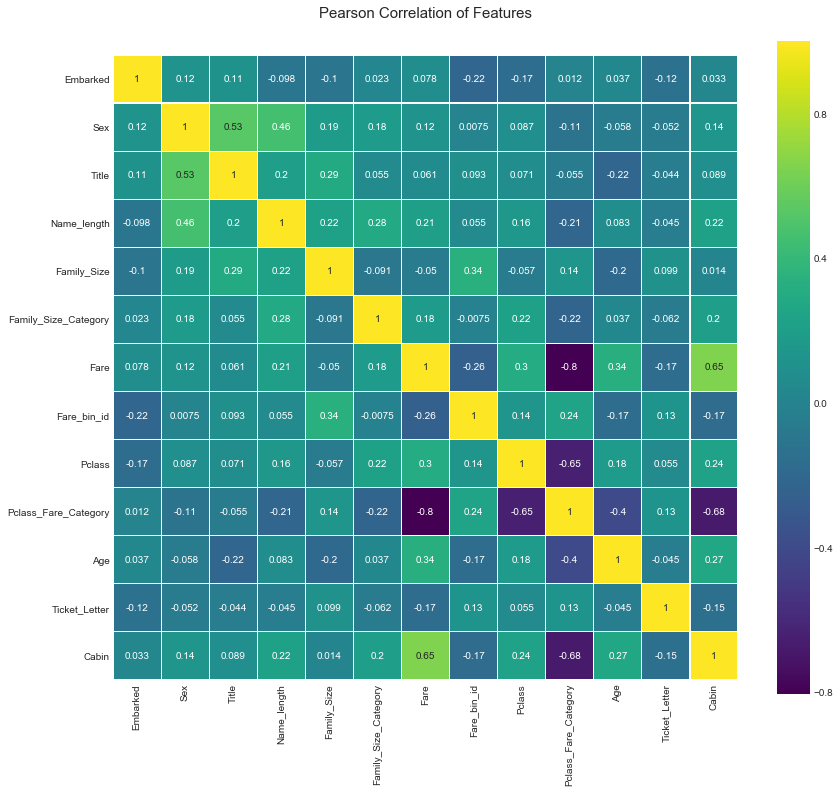


# 特征之间的数据分布图


```python
g = sns.pairplot(combined_train_test[[u'Survived', u'Pclass', u'Sex', u'Age', u'Fare', u'Embarked',
       u'Family_Size', u'Title', u'Ticket_Letter']], hue='Survived', palette = 'seismic',size=1.2,diag_kind = 'kde',diag_kws=dict(shade=True),plot_kws=dict(s=10) )
g.set(xticklabels=[])

```


    <seaborn.axisgrid.PairGrid at 0x2887b60ee48>


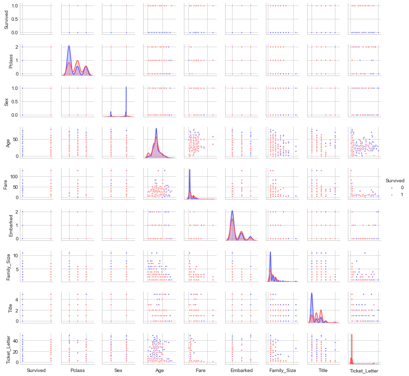


# 输入模型前的一些处理：
## 1. 一些数据的正则化

这里我们将Age和fare进行正则化：


```python
scale_age_fare = preprocessing.StandardScaler().fit(combined_train_test[['Age','Fare', 'Name_length']])
combined_train_test[['Age','Fare', 'Name_length']] = scale_age_fare.transform(combined_train_test[['Age','Fare', 'Name_length']])

```

## 2. 弃掉无用特征

对于上面的特征工程中，我们从一些原始的特征中提取出了很多要融合到模型中的特征，但是我们需要剔除那些原本的我们用不到的或者非数值特征：

首先对我们的数据先进行一下备份，以便后期的再次分析：


```python
combined_data_backup = combined_train_test

```


```python
combined_train_test.drop(['PassengerId', 'Embarked', 'Sex', 'Name', 'Title', 'Fare_bin_id', 'Pclass_Fare_Category', 
                          'Parch', 'SibSp', 'Family_Size_Category', 'Ticket'],axis=1,inplace=True)

```

## 3. 将训练数据和测试数据分开：


```python
train_data = combined_train_test[:891]
test_data = combined_train_test[891:]

titanic_train_data_X = train_data.drop(['Survived'],axis=1)
titanic_train_data_Y = train_data['Survived']
titanic_test_data_X = test_data.drop(['Survived'],axis=1)

```


```python
titanic_train_data_X.shape

```


    (891, 32)


# 6. 模型融合及测试
模型融合的过程需要分几步来进行。

(1) 利用不同的模型来对特征进行筛选，选出较为重要的特征：
